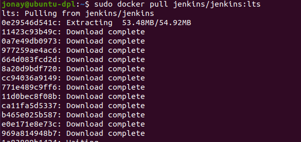

# Instalación Jenkins en Docker


## 1. Introducción.
En la actualizada muchas empresas de desarrollo se están usando practicas para agilizar el trabajo, una de estas practicas es la integración continua esta permite a los desarrolladores combinar los cambios del código en un repositorio central de manera periódica con sistema de versión y pruebas automáticas.
Otra practica importante en el desarrollo es la de desarrollo continuo, esta practica consiste en la automatización de actualización para la aplicaciones  implementada en producción.

Estas dos practicas se conocen como CI/CD y hay muchas herramientas que nos permiten realizar estas practicas de manera mas eficientes, una de las mas usas es Jenkins. 
Jenkins es una herramienta open source para que nos permite compilar y probar proyectos de software que de manera continua que nos permite integrar cambios en el proyecto y en las actualizaciones.

Ademas tenemos Docker que ya hemos hablado y trabajado otras guias. Docker es una herramienta que nos permiten lanzar “contenedores” para ejecutar apalicaciones con una capa de abstracción y totalmente aisladas del sistema. 

En esta guiá veremos concretamente como instalar Jenkins usando la tecnología de contenedores.

## 2. Instalación en Docker.
Un requisito fundamental antes de proceder con la instalación es tener instalado tanto Docker como Docker Compose en nuestro servidor y por otro lado asegurarse de que no tenemos ninguna aplicaciones corriendo en el puertos 8080.

Con los requisitos ya mencionados realizados vamos a proceder con la instalación del primero contenedor usando docker, para ello vamos a la pagina dockerhub y buscamos la imagen de jenkins:


Con la imagen ya seleccionado podemos descargar o realizar un pull por linea de comando usando el nombre que vimos en la página:
```
sudo docker pull jenkins/jenkins:lts
```




Ahora comprobamos que tenenos la imagen descargada correctamente:
```
sudo docker images
```


Y ahora vamos a crear el contenedor con la siguiente linea.
```
sudo docker run -p 8080:8080 -p 50000:50000 -v /home/jonay/jenkins_home:/var/jenkins_home jenkins/jenkins:lts
```

donde:
- -p : mapeado de puerto de nuestra maquina al contenedor (puerto-servidor:puerto-contenedor).
- -v: aquí se declara el volumen de carpeta entre la maquina y el servidor, en este caso este volumen nos permitirá tener la instalación de jenkins y la configuración en esa carpeta para que al eliminar el contenedor y volver a lanzarlos no perdamos los datos.


Antes de acceder al Jenkins vamos a crear un dominio en apache.

Primero añadimos nuestro dominio en “/etc/hosts”


Creamos el conf.


Activamos el sitio web.


Reiniciamos apache.


Y ahora accedemos al dominio para ver Jenkins.


## 3. Instalación Docker Compose.

Ya vimos como crear un contenedor con Docker ahora vamos a ver como realizarlo con Docker Compose.

Primero vamos a crear un carpeta donde pondremos todos estos ficheros. Y empezamos creando el fichero Dockerfile que lo usaremos para añadir configuraciones a Jenkins, en esta caso actualizar el sistema, instalar maven y una serie de plugins.


Lista de plugins
```
ace-editor
ant
antisamy-markup-formatter
apache-httpcomponents-client-4-api
authentication-tokens
branch-api
build-monitor-plugin
build-pipeline-plugin
cloudbees-folder
conditional-buildstep
copyartifact  
credentials
credentials-binding
deploy
display-url-api
docker-commons
docker-workflow
durable-task
git
github
github-api
git-client
git-server
gradle
greenballs
handlebars
jackson2-api
javadoc
jquery
jquery-detached
jsch
junit
mailer
matrix-project
maven-plugin
momentjs
nested-view
parameterized-trigger
pipeline-build-step
pipeline-graph-analysis
pipeline-input-step
pipeline-milestone-step
pipeline-model-api
pipeline-model-declarative-agent
pipeline-model-definition
pipeline-model-extensions
pipeline-rest-api
pipeline-stage-step
pipeline-stage-tags-metadata
pipeline-stage-view
plain-credentials
run-condition
scm-api
script-security  
ssh-credentials
structs
token-macro
workflow-aggregator
workflow-api
workflow-basic-steps
workflow-cps
workflow-cps-global-lib
workflow-durable-task-step
workflow-job
workflow-multibranch
workflow-scm-step
workflow-step-api
workflow-support
```

Los añadimos a un txt.


Ahora creamos el docker-compose.yml con la siguiente información.


Donde:
- build: ponemos un “.” para que busque el Dockerfile en la misma carpeta
- image: imagen que se usara en el contenedores
- restart: Reinicia todos los servicio detenidos y en ejecución. 
- hostname: nombre del contenedor
- ports: puertos de la maquina
- volumen: lo mismo en se explica en el apartado de arriba

Construimos el contenedor.


Lanzamos el contenedor.


Ahora para comprobar que todo esta bien podemos acceder al dominio que hemos creado anteriormente. Asegurate de haber borrado el anterior contenedor para que no hay conflicto con el puerto.


## 4. Configuración.
Vamos a configurar Jenkins como ya se a hecho en otra guiá. Primero necesitamos la contraseña para realizar la configuración de Jenkins, para esto vamos a lanzar el siguiente comando contra el servidor para que nos devuelve la contraseña.
```
sudo docker exec -it dockerjenkins_master_1 cat /var/jenkins_home/secrets/initialAdminPassword
```


La añadimos en la página de Jenkins y veremos la siguiente página donde seleccionaremos la primera opción.


Getting Started.


Creamos el usuario.


URL para para Jenkins.


Finalizada la instalación.


Página principal.

