# Instalación Jenkins


## 1. Introducción.
En la actualizada muchas empresas de desarrollo se están usando practicas para agilizar el trabajo, una de estas practicas es la integración continua esta permite a los desarrolladores combinar los cambios del código en un repositorio central de manera periódica con sistema de versión y pruebas automáticas.
Otra practica importante en el desarrollo es la de desarrollo continuo, esta practica consiste en la automatización de actualización para la aplicaciones  implementada en producción.

Estas dos practicas se conocen como CI/CD y hay muchas herramientas que nos permiten realizar estas practicas de manera mas eficientes, una de las mas usas es Jenkins. 
Jenkins es una herramienta open source para que nos permite compilar y probar proyectos de software que de manera continua que nos permite integrar cambios en el proyecto y en las actualizaciones.

## 2. Instalación.
Primero de todo vamos a ver como instalar Jenkins en esta guiá se mostrara como realizar la instalación en un servidor Ubuntu20.04. Aparte de del servidor Ubuntu para realizar la guiá también se necesita tener instalado  el Open JDK, en este caso la 11.

Con los requisitos ya mencionados realizados vamos a proceder con la instalación, los primero oque vamos a hace es agregar la clave al repositorio del sistema:
```
wget -q -O - https://pkg.jenkins.io/debian-stable/jenkins.io.key | sudo apt-key add
```

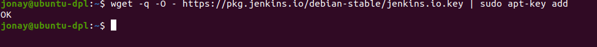


Seguimos con anexar la dirección de paquetes a source.list del servidor:
```
sudo sh -c 'echo deb http://pkg.jenkins.io/debian-stable binary/ > /etc/apt/sources.list.d/jenkins.list'
```

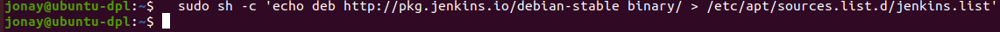


Antes de instalar vamos a realizar un update con apt:
```
sudo apt update
```

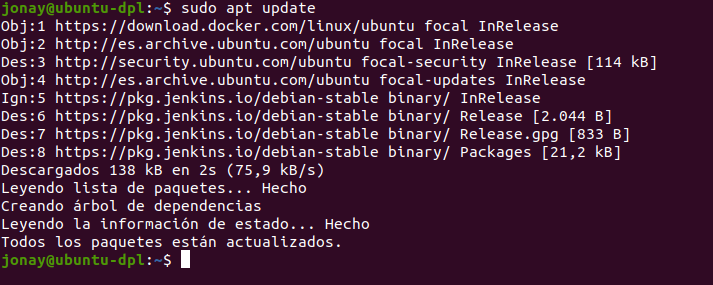


Ahora si procedemos a instalar Jenkins con apt:
```
sudo apt install jenkins
```

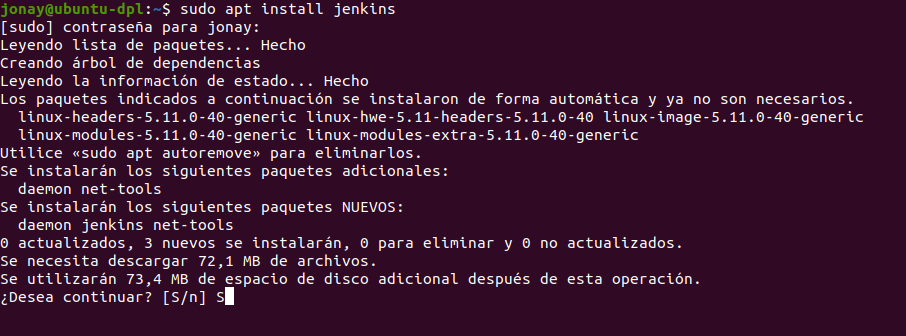


## 3. Configuración.
Ahora vamos a configurar Jenkins pero antes vamos a comprobar el servicio y añadir las reglas pertinentes en FireWall.

Primero vamos a iniciar Jenkins con systemctl:
```
sudo systemctl start jenkins
```

Luego si no tenemos ningún problemas vamos a comprobar el status del servicio, en caso de tener algún problema comprobar que no hay ninguna aplicación/servicio corriendo en el puerto 8080.
```
sudo systemctl status jenkins
```

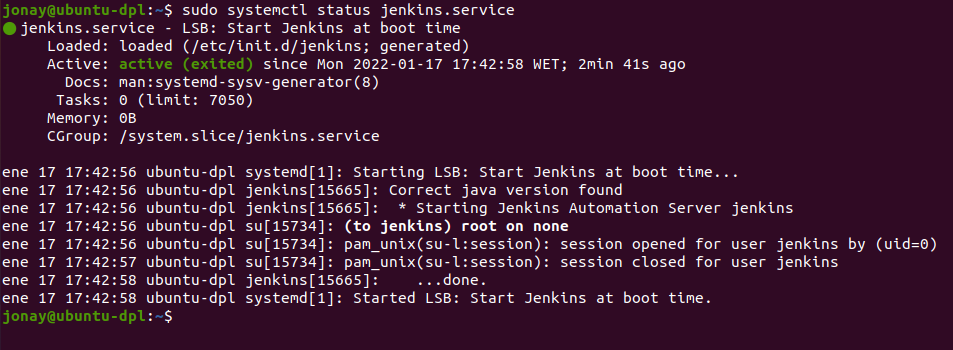


Lo siguiente es añadir las reglas del cortafuegos del puerto (solo en caso de que quieras que puedan acceder al Jenkins desde fuera de la maquina directamente) y OpenSSH.
``` 
sudo ufw allow 8080
```

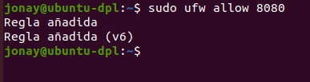


Añadimos la regla para el ssh y activamos el cortafuego.
```
sudo ufw allow OpenSSH
sudo ufw enable
```

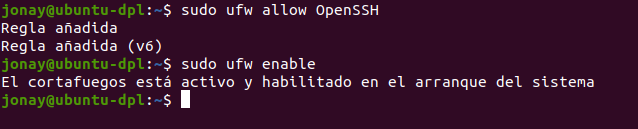


También podemos realizar un status del cortafuego para ver las reglas que hemos añadido.

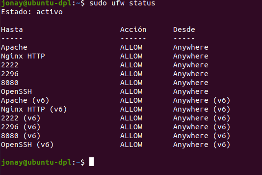


## 4. Crear Dominio.
Este paso es opcional y explica como crear un dominio para acceder a Jenkins. El primer paso es de añadir en nombre de dominio al fichero “/etc/hosts”:
```
sudo nano /etc/hosts 
```


Luego vamos a “/etc/apache2/site-available” y crear el fichero “.conf” de nuestro dominio.

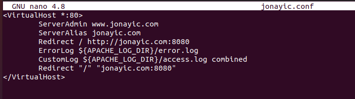


Con esto realizado añadimos el dominio a apache con el siguiente comando:
```
sudo a2ensite jonayic.conf
```

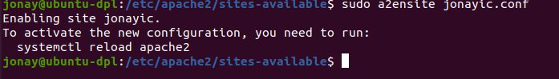


Con esto realizado al acceder al dominio nos llevara a Jenkins.


## 5. Configura Jenkins.
Con el dominio hecho para empezar la configuración tenemos que acceder al dominio o dirección ip en un navegador: http://your_server_or_domain:8080, en nuestro caso lo poniendo la dirección del dominio que hemos creado debería funcionar.

Al entrar en la pagina veremos que nos pide una contraseña para continuar, esta la encontraremos poniendo la siguiente linea en el terminal:
```
sudo cat /var/lib/jenkins/secrets/initialAdminPassword
```

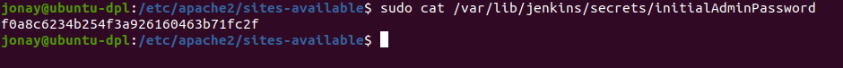


Luego volvemos a ir a la pagina principal y añadimos la contraseña para continuar.

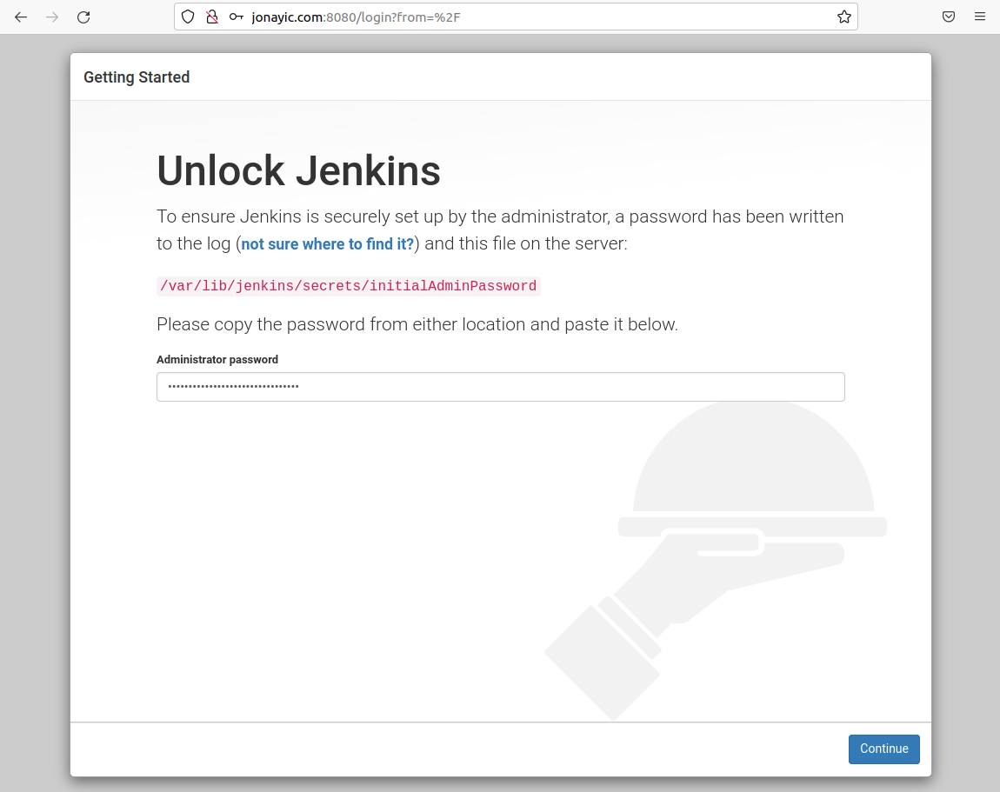


En la pestaña de instalación de complementos seleccionamos la opción “Install suggested plugins” para instalar los complementos sugeridos.


En la siguiente pestaña veremos la creación de usuario.

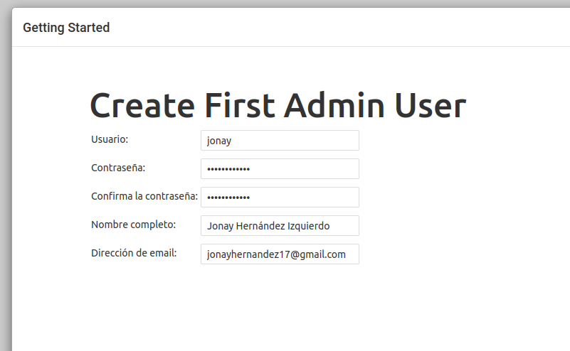


Configuración de instancia, donde nos solicitara que confirmemos la url que preferimos para Jenkins.

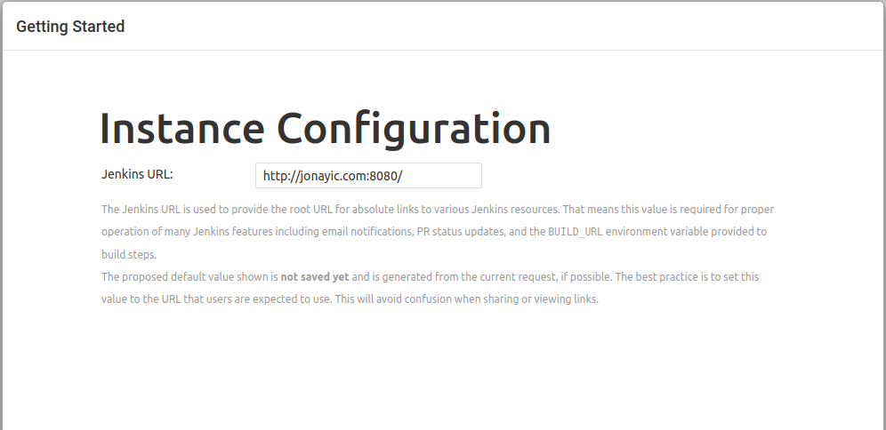


Por ultimo pulsamos para ir a la pagina principal de Jenkins.

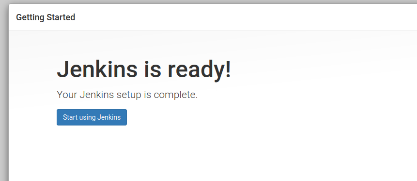

Pagina principal.
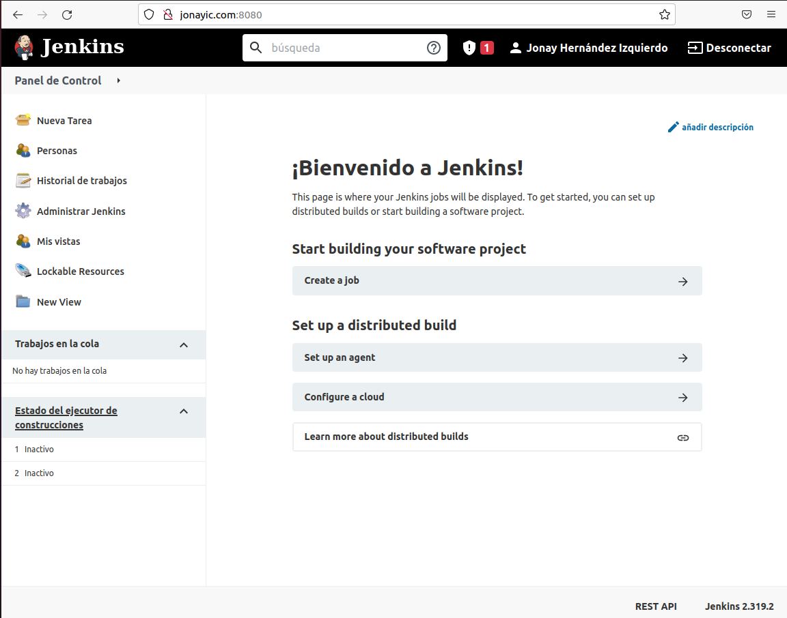
