# Pipeline en Jenkins.

## 1. Introducción.
En esta guiá vamos a ver como realizar un pipeline de una aplicaciones Java desplegada en un Tomcat en Docker.

## 2. Preparación. 
Para realizar la siguiente practica primero hay que tener en cuenta los siguiente punto:
- Tener instado tanto JAVA como MAVEN en el servidor.
- Tener instalado Docker.
- Tener instalado y configurado Jenkins.

Para empezar vamos a clonar el proyecto que se encuentra en el siguiente enlace . Con el proyecto descargado vamos a crear un un nuevo repositorio en GitHub con la información.
Proyecto básico descargado.

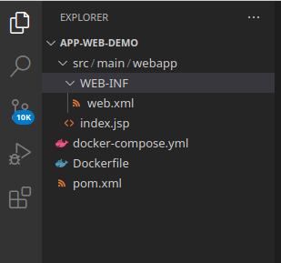

Ahora vamos a modificar el proyecto, primero borramos el “docker-compose.yml” y luego vamos a modificar el Dockerfile.
En el fichero Dockerfile vamos a usar la imagen “tomcat:9.0” y luego vamos a mover el WAR que se generará en la carpeta del proyecto al contenedor por ultimo especificamos el puerto y lanzamos el sh.

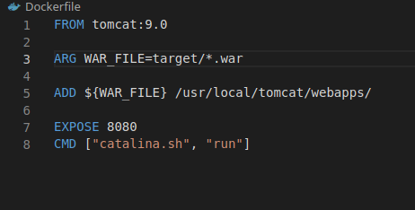

El otro archivo importante que vamos a crear es el Jenkinsfile, en este archivo se describen los pasos que se van realizar en el pipeline. Aquí vemos 4 steps:
- Test Junit: aquí lanzamos “mvn clean text” para limpiar y ejecutar los test
- Build: aquí vamos a realizar un package y install del proyecto(aquí se genera la carpeta “targer” con archivo .war).
- Deploy: aquí vamos a crear la imagen de docker y lanzar el contenedor Tomcat.
- Test Integration; aquí va nis a probar que la pagina de la app esta operativa y comprobar que en la página web esta escrito en nombre que hemos especificado para verificar que el contenido del html esta correcto.

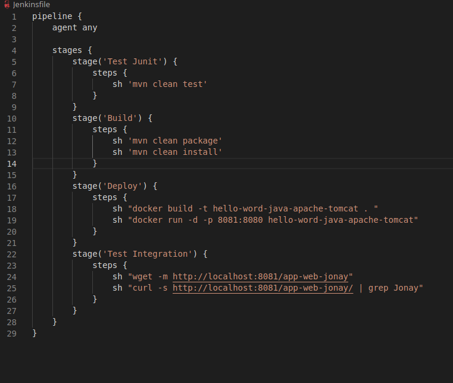

Ahora vamos a ver como hemos dejado los siguiente archivos.

Index.jsp

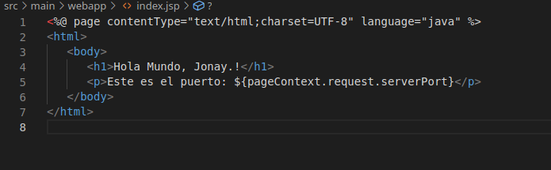

web.xml

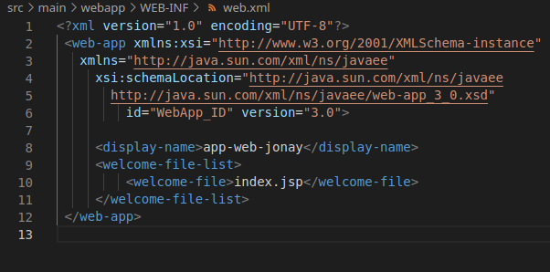

## 3. Crear Pipeline.
Con toda la preparación realizada antes de crear la pipeline lo que tendremos que hacer es un push a github del repositorio.

Con el push realizado vamos a crear la Pipeline para ello vamos a Jenkins y seleccionamos nueva tarea.

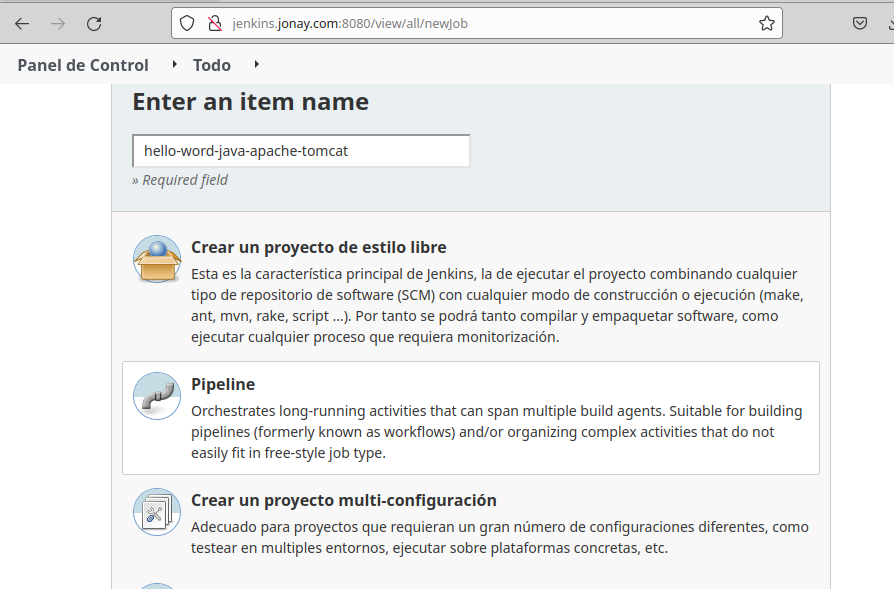

En la siguiente pestaña seleccionamos “Advanced Proyect Options” y ponemos la configuración que ves a continuación. Cambiar la url del repositorio por el tuyo y tener cuidad de especificar correctamente la rama del proyecto.

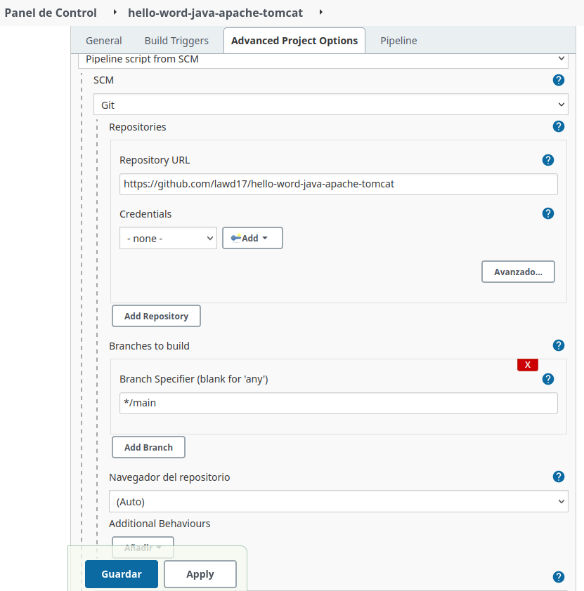

Al terminar de crear la pipeline le damos a “Construir ahora” para comenzar a ejecutar la pipeline.

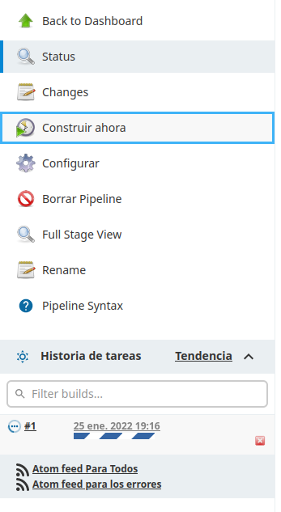

Al terminar de ejecutar tendremos algo como lo siguiente.

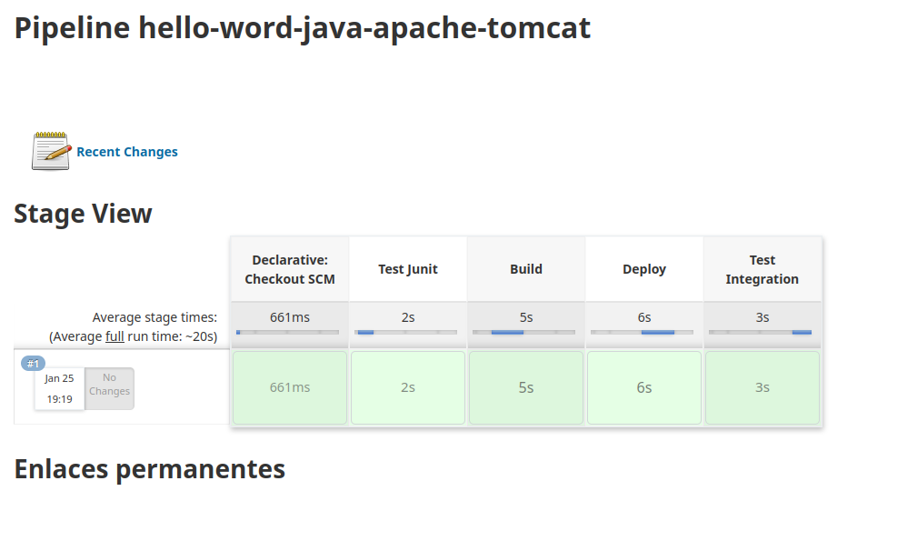

Y si vamos al panel de control veremos algo como esto.

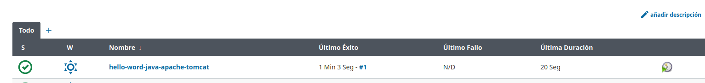

Con todos los steps realizado correctamente podemos estar seguros de que la aplicación esta funcionando, pero aun así podemos acceder por url al puerto y la ruta par ver la aplicación.

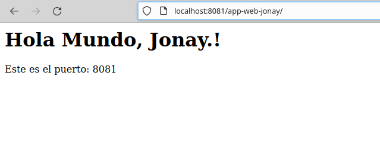