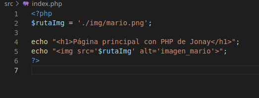

# Creación de Pipeline en PHP y Apache

## 1. Introducción.
En esta guiá vamos a contruir una pipeline de un proyecto en Github.

## 2. Preparación. 
Primero de todo debemos crear el proyecto que vamos a subir a github, por lo que vamos a crear un nuevo repositorio en nuestro github. En este caso lo hemos nombrado "php-helloworld".

Nos lo clonamos en nuestra maquina para empezar a trabajar.

Y creamos una estructura básica que estará formada por una carperta src donde se encuentra un fichero "index.php" y una carpeta con un imagen que se va a mostrar en la página.

Contenido del fichero "index.php".

Ahora vamos a crear un fichero Dockerfile para crear un contenedor apache-php que nos permite desplegar nuestra pagina. También vamos a crear un fichero Jenkinsfile con los pasos que hay realizar en la pipeline. Todos estos fichero irán en la raíz del repositorio.

Fichero Dockerfile.

Fichero Jenkinsfile

Con esto realizado vamos a realizar un push de nuestro repositorio para subirlo a Github.

## 3. Creación Pipeline.
Con los pasos anteriores realizado vamos a nuestro Jenkins y creamos un nueva pipeline.

Creamos el nuevo pipeline.

Nos vamos al apartador de "Advanced Proyect Options" añadimos la configuración siguiente.

Pipeline creada.

Pulsamos en "Construir ahora" para lanzar el pipeline.

Si toda ha ido bien veremos algo como lo siguiente.

Y en el panel de control veremos lo siguiente.

No habría necesidad de probar la pagina ya que el step de "probar página" de pipeline esta ok, pero si accedes al puerto por un navegador podremos ver la página.

